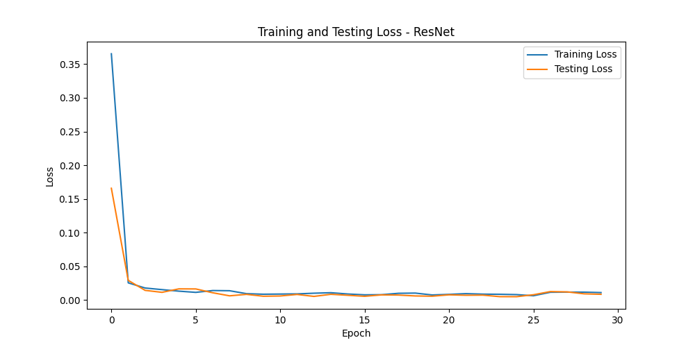
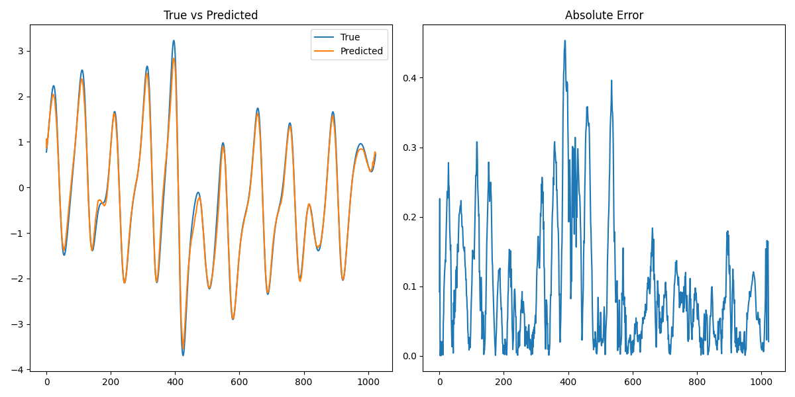
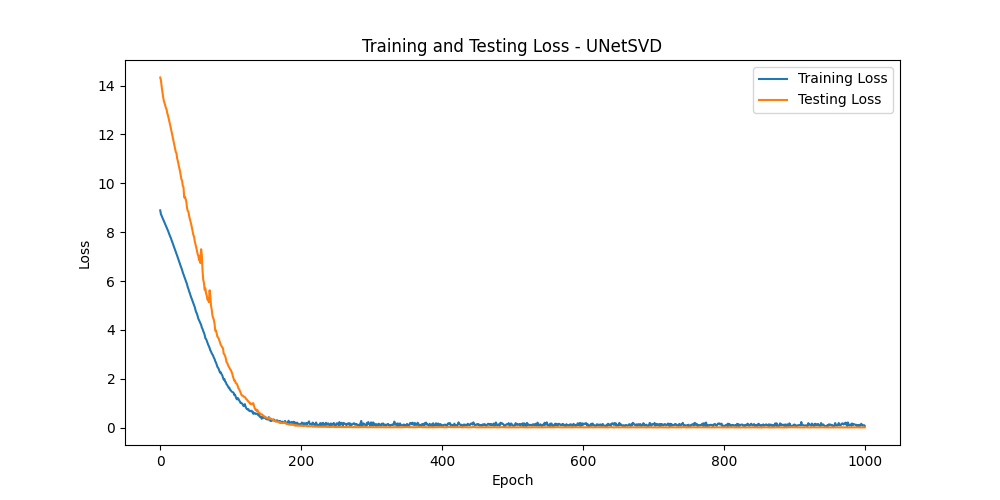
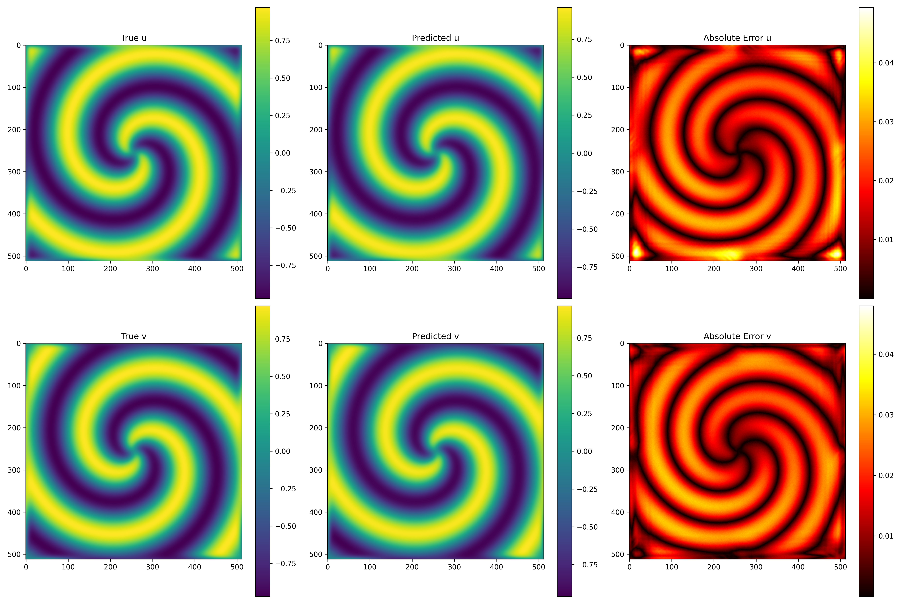
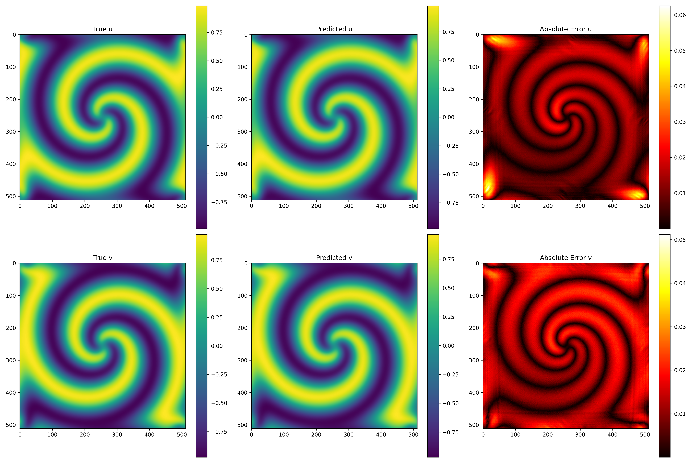

# Neural Network Time-Stepping Prediction for Dynamical Systems

This report presents the implementation and results of using neural networks to predict time-stepping features generated by two different dynamical systems:
1. Kuramoto-Sivashinsky equation (Problem 1)
2. Reaction-Diffusion system of equations (Problem 2)


## Problem 1: Kuramoto-Sivashinsky Equation

### Problem Description
The Kuramoto-Sivashinsky (KS) equation is a nonlinear partial differential equation that exhibits chaotic behavior and is used to model various physical phenomena including flame fronts and fluid turbulence. In this problem, we aim to predict the next time step of the KS system given the current state.

### Data Description
- Two datasets (`kuramoto_sivishinky_0.mat` and `kuramoto_sivishinky_1.mat`) were combined
- Each dataset contains spatial-temporal data of the KS equation
- Input: State at time t, represented as a 1D spatial array of size 1024
- Output: State at time t+1, also a 1D spatial array of size 1024

### Model Architecture
We implemented and compared three different neural network architectures:
1. **Fully Connected Network (FCNet)**: A simple MLP with hidden layers
2. **Convolutional Neural Network (ConvNet)**: Using 1D convolutions to capture spatial patterns
3. **Residual Network (ResNet)**: Incorporating residual connections for better gradient flow

The final model selected was the **ResNet** architecture with the following characteristics:
- Input layer: 1D convolution with 64 channels
- 4 residual blocks, each containing two convolutional layers with batch normalization
- Output layer: 1D convolution to map back to the original dimension
- Total parameters: 166,209

```python
# ResNet architecture for KS equation prediction
class ResBlock(nn.Module):
    def __init__(self, channels):
        super(ResBlock, self).__init__()
        self.conv1 = nn.Conv1d(channels, channels, kernel_size=5, padding=2)
        self.bn1 = nn.BatchNorm1d(channels)
        self.relu = nn.ReLU()
        self.conv2 = nn.Conv1d(channels, channels, kernel_size=5, padding=2)
        self.bn2 = nn.BatchNorm1d(channels)

    def forward(self, x):
        residual = x
        out = self.relu(self.bn1(self.conv1(x)))
        out = self.bn2(self.conv2(out))
        out += residual
        out = self.relu(out)
        return out

class ResNet(nn.Module):
    def __init__(self, input_size, num_blocks=4):
        super(ResNet, self).__init__()
        self.input_size = input_size
        self.channels = 64

        self.conv1 = nn.Conv1d(1, self.channels, kernel_size=5, padding=2)
        self.bn1 = nn.BatchNorm1d(self.channels)
        self.relu = nn.ReLU()

        self.res_blocks = nn.ModuleList([ResBlock(self.channels) for _ in range(num_blocks)])

        self.conv_out = nn.Conv1d(self.channels, 1, kernel_size=5, padding=2)

    def forward(self, x):
        # Reshape for 1D convolution
        x = x.view(-1, 1, self.input_size)

        x = self.relu(self.bn1(self.conv1(x)))

        for block in self.res_blocks:
            x = block(x)

        x = self.conv_out(x)

        # Reshape back to original dimensions
        return x.view(-1, self.input_size)
```

### Training Process
- Loss function: Mean Squared Error (MSE)
- Optimizer: Adam with learning rate 0.001
- Batch size: 32
- Number of epochs: 30
- Train-test split: 80%-20%

### Results
- Final training loss: 0.011136
- Final testing loss: 0.008610
- The testing loss is lower than the training loss, which suggests good generalization
- The model successfully captures the dynamics of the KS equation, as evidenced by the low prediction error



### Visualization
The model predictions were visualized by comparing the true and predicted states, along with the absolute error. The visualizations show that the model can accurately predict the next state of the KS system, with errors primarily concentrated in regions of high spatial gradient.



## Problem 2: Reaction-Diffusion System

### Problem Description
Reaction-Diffusion (RD) systems are mathematical models that describe how the concentration of one or more substances changes under the influence of two processes: local chemical reactions and diffusion. These systems can generate a variety of patterns and are used to model various biological and chemical processes. In this problem, we aim to predict the next time step of a two-component (u,v) RD system.

### Data Description
- Two datasets of RD systems were combined
- Each dataset contains spatial-temporal data with dimensions 512×512×201 (height×width×time)
- The data consists of two components (u and v) that interact through the RD equations
- Due to the high dimensionality, Singular Value Decomposition (SVD) was applied for dimensionality reduction

### Dimensionality Reduction
- Truncated SVD was applied to reduce the spatial dimensions (512×512) to 200 components
- The explained variance ratio was 1.0000 for both u and v components, indicating that the reduced representation fully captures the original data
- This reduced the input/output size from 524,288 to just 400 dimensions (200 for each component)

```python
# Apply SVD for dimensionality reduction
def apply_svd(data, n_components=100):
    """
    Apply SVD to reduce dimensionality of spatial data

    Args:
        data: Input data of shape (height, width, time)
        n_components: Number of SVD components to keep

    Returns:
        reduced_data: Data with reduced spatial dimensions
        svd_model: Fitted SVD model for later reconstruction
    """
    # Reshape to (time, height*width)
    height, width, time = data.shape
    data_reshaped = np.zeros((time, height * width))

    # Manual reshaping to avoid memory issues
    for t in range(time):
        data_reshaped[t] = data[:, :, t].flatten()

    # Apply SVD
    svd = TruncatedSVD(n_components=n_components)
    reduced_data = svd.fit_transform(data_reshaped)

    print(f"Explained variance ratio: {svd.explained_variance_ratio_.sum():.4f}")

    return reduced_data, svd
```

### Model Architecture
We implemented a UNet-inspired architecture (UNetSVD) with the following characteristics:
- Encoder path: Three blocks with increasing channel dimensions (256, 512, 1024)
- Bottleneck: 2048 channels
- Decoder path: Three blocks with skip connections from the encoder
- Each block contains two linear layers with ReLU activation and batch normalization
- Total parameters: 14,067,088

```python
# UNet-inspired architecture for SVD-reduced data
class UNetSVDBlock(nn.Module):
    def __init__(self, in_channels, out_channels):
        super(UNetSVDBlock, self).__init__()
        self.block = nn.Sequential(
            nn.Linear(in_channels, out_channels),
            nn.ReLU(),
            nn.BatchNorm1d(out_channels),
            nn.Linear(out_channels, out_channels),
            nn.ReLU(),
            nn.BatchNorm1d(out_channels)
        )

    def forward(self, x):
        return self.block(x)

class UNetSVD(nn.Module):
    def __init__(self, input_size, output_size=None):
        super(UNetSVD, self).__init__()
        if output_size is None:
            output_size = input_size

        # Encoder path
        self.enc1 = UNetSVDBlock(input_size, 256)
        self.enc2 = UNetSVDBlock(256, 512)
        self.enc3 = UNetSVDBlock(512, 1024)

        # Bottleneck
        self.bottleneck = UNetSVDBlock(1024, 2048)

        # Decoder path with skip connections
        self.dec3 = UNetSVDBlock(2048 + 1024, 1024)  # +1024 for skip connection
        self.dec2 = UNetSVDBlock(1024 + 512, 512)    # +512 for skip connection
        self.dec1 = UNetSVDBlock(512 + 256, 256)     # +256 for skip connection

        # Final output layer
        self.final = nn.Linear(256, output_size)

    def forward(self, x):
        # Encoder
        enc1 = self.enc1(x)
        enc2 = self.enc2(enc1)
        enc3 = self.enc3(enc2)

        # Bottleneck
        bottleneck = self.bottleneck(enc3)

        # Decoder with skip connections
        dec3 = self.dec3(torch.cat([bottleneck, enc3], dim=1))
        dec2 = self.dec2(torch.cat([dec3, enc2], dim=1))
        dec1 = self.dec1(torch.cat([dec2, enc1], dim=1))

        # Final output
        output = self.final(dec1)

        return output
```

### Training Process
- Loss function: Mean Squared Error (MSE)
- Optimizer: Adam with learning rate 0.001
- Batch size: 64
- Number of epochs: 1000
- Train-test split: 80%-20%

### Results
- Final training loss: 0.070779
- Final testing loss: 0.013226
- The significant difference between training and testing loss may be attributed to the batch normalization layers behaving differently during training versus testing
- Error metrics for Dataset 0:
  - Mean Absolute Error (MAE): 0.016347 (u component), 0.015462 (v component)
  - Mean Squared Error (MSE): 0.000348 (u component), 0.000318 (v component)
- Error metrics for Dataset 1:
  - Mean Absolute Error (MAE): 0.010563 (u component), 0.011707 (v component)
  - Mean Squared Error (MSE): 0.000165 (u component), 0.000174 (v component)



### Visualization
The model predictions were visualized by:
1. Reconstructing the full spatial dimensions from the SVD components
2. Comparing the true and predicted states for both u and v components
3. Calculating and visualizing the absolute error

The visualizations demonstrate that the model can accurately predict the complex patterns in the RD system, with relatively small errors distributed across the spatial domain.





## Comparison and Discussion

### Similarities
- Both problems involve predicting the next time step of a dynamical system
- Both implementations use neural networks with residual/skip connections
- Both models achieve good prediction accuracy with relatively low error

### Differences
- The KS equation is one-dimensional, while the RD system is two-dimensional with two components
- The RD problem required dimensionality reduction due to the much higher dimensionality
- The RD model is significantly larger (14M vs 166K parameters)
- The RD model shows a larger gap between training and testing loss

### Conclusions
1. Neural networks can effectively learn the dynamics of complex nonlinear systems
2. Dimensionality reduction techniques like SVD can make high-dimensional problems tractable
3. Architectures with skip connections (ResNet, UNet) perform well for these types of prediction tasks
4. The models can generalize well to unseen data, suggesting they've captured the underlying physics
